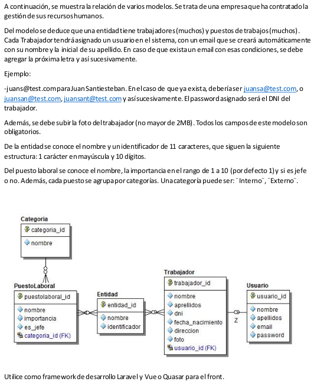

# Requerimientos
<div align="center">
    <a href="#">
       
    </a>
</div>


## Listado de tecnologias y frameworks utilizados
1.- php Version 7.2.x

2.- Node Version 14.x (npm o yarn)

3.- Mysql Version > 5.7

4.- Laravel 8.5.20 (composer)

5.- Vue 2.6.x

# Instalacion de la app
1.- Clonar o descargar la aplicacion

2.- Situarse en la carpeta raiz de la aplicacion

3.- Instalar las dependencias del composer (tener instalado composer en el Sistema Operativo)
```
composer install
```

4.- Instalar las dependencias del node_modules (tener instalado node en el Sistema Operativo)
```
npm install
```

5.- Especificar las variables de entorno para la conexion con la base de datos en el archivo .env, se puede copiar y pegar el archivo .env.example y despues renombrarlo a .env 
```
cp .env.example .env
```

6.- Crear la base de datos especificado en la variable de entorno anteriormente en el gestor de la base de datos(en este caso se utiliza mysql)


7.- Hacer la migracion de la base de datos (crear las tablas)
```
php artisan migrate
```

7.1 Para cargar datos de pruebas ejuctar el siguiente comando
```
php artisan migrate:refresh --seed
```

8.- Probar la aplicacion
```
php artisan serve
```
